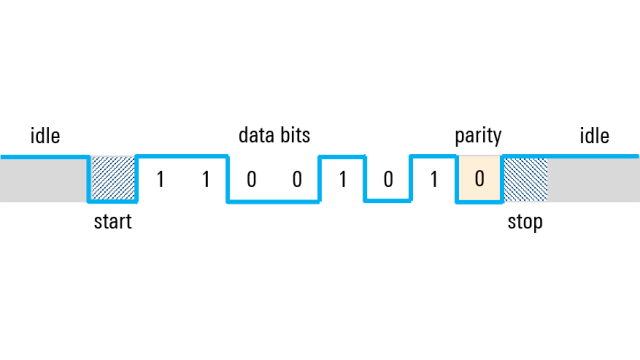

# Serial Communication
A comunicação serial é fundamental para se poder utilizar os diferentes periféricos com os quais um FPGA é capaz de interagir. Protocolos seriais geralmente são simples e diretos, fáceis de usar. Por isso, eles são largamente adotados e temos várias versões como UART, SPI e I2C.

> O objetivo deste laboratório é implementar o protocolo UART como exemplo de comunicação serial.

## UART
O protocolo UART prevê uma linha única de dados (em cada sentido) que descansa em nível alto. Quando a comunicação vai se iniciar, o transmissor coloca a linha em nível baixo e no ciclo seguinte começa a enviar os bits. São enviados 8 bits sendo que o oitavo bit é de paridade, do tipo par. Ao final da transmisão, a linha deve voltar a descansar no nível alto. Veja o diagrama de bits a seguir. **Use o tema claro do github para poder ver os dígitos**

## Atividade
Esta atividade consiste em construir **dois** módulos Verilog: um transmissor de dados e outro receptor. Eles devem seguir o protocolo UART e têm as seguintes especificações:

Módulo Transmissor |  |
|--------------|----|
| start        | Sinal que indica que o transmissor deve começar a enviar os dados. no ciclo seguinte à sinalização do *start* a linha já deve estar em nível baixo. |
| data_in    | Entrada de 7 bits com os dados a serem enviados. Ela é lida no ciclo que *start* fica em nível alto|
| serial_out  | Saida serial por onde os dados serão enviados
| clk | relógio |
| rstn| reset |

Módulo Receptor |  |
|--------------|----|
| serial_in    | Entrada de dados serial
| ready        | Quando o receptor estiver com todos os dados da palavra de 7 bits, ele deve sinalizar isso com *ready*|
| data_out     | Saída de 7 bits mostrando os dados lidos. Só é valida quando *ready* estiver em nível alto |
| parity_ok_n  | Saída que indica que a paridade par dos 8 bits recebidos está ok. Nível baixo significa paridade ok |
| clk | relógio |
| rstn| reset |

Para que o transmissor e o receptor consigam se comunicar, ambos devem ter um sinal de relógio igual, de mesma frequência, ditando o ritmo da comunicação. Para fazer isso, basta usar um relógio comum para os dois.

Quando o reset é acionado, o transmissor passa a aguardar o sinal de *start* e o receptor fica pronto para receber os dados, vigiando a linha.

Depois que os dados forem transmitidos, a linha deve ficar parada em nível alto até o fim da simulação.

> O bit a ser enviado primeiro é o menos significativo dos 7, e o bit de paridade é enviado por último.

## Execução da atividade

Siga o modelo de módulo já fornecido e utilize o testbench e scripts de execução para sua verificação. Em seguida, implemente o circuito de acordo com as especificações e, se necessário, crie outros testes para verificá-lo.

Uma vez que estiver satisfeito com o seu código, execute o script de testes com `./run-all.sh`. Ele mostrará na tela `ERRO` em caso de falha ou `OK` em caso de sucesso.

## Entrega

Para submeter o projeto, basta fazer um *commit* no repositório do **GitHub Classroom**. O sistema de correção automática já está configurado para validar sua implementação e atribuir uma nota com base nos testes.  

> **Dica:**  Evite modificar os arquivos de correção! Para entender como os testes funcionam, consulte o script `run.sh` disponível no repositório.
